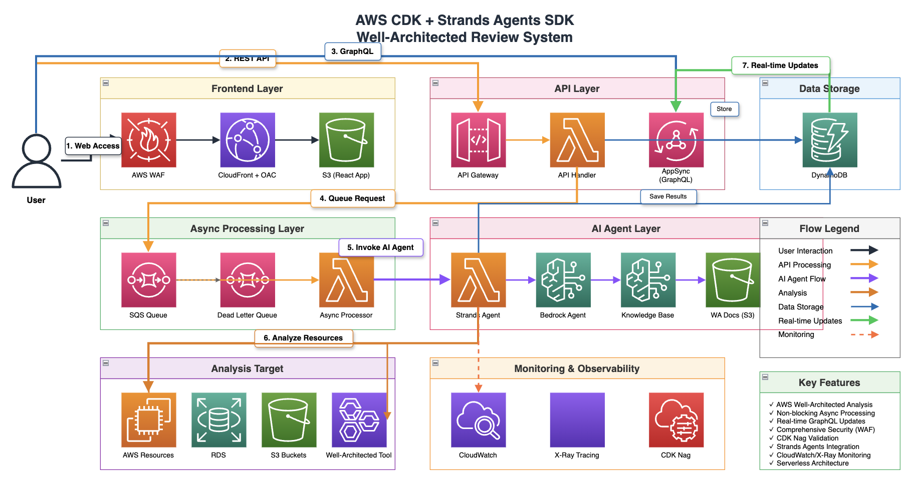

※本リポジトリは [AWS CDK Conference Japan 2025 presented by JAWS-UG](https://jawsug-cdk.connpass.com/event/356357/) 内のイベント「🏝️🎛️CDK Vibe Coding Fes‼️🎛️ 🏝️」にて、Claude Codeが作成したものです。cdk synthはできましたが、デプロイ確認等はしていませんので、使用する際は自己責任でお願いします。

# CDK Conference - Strands Agents Well-Architected レビュープラットフォーム

AWS CDKで構築されたサーバーレスプラットフォームです。AIエージェントを活用してAWS Well-Architected Frameworkの自動レビューを実施します。複数のAWSサービスを組み合わせて包括的なアーキテクチャ評価とインテリジェントな推奨事項を提供します。

## 概要

このプラットフォームは、AIエージェントとAWSサービスの統合によってWell-Architectedレビューを自動化する仕組みを示しています。以下の機能を提供します：

- **自動化されたアーキテクチャレビュー**: AIによるAWSインフラストラクチャの分析
- **リアルタイム処理**: SQSとLambdaによるイベント駆動アーキテクチャ
- **GraphQL API**: AppSyncを使用したリアルタイム更新API
- **Webインターフェース**: CloudFrontで配信されるフロントエンド
- **セキュアな設計**: CDK Nag検証によるWell-Architectedベストプラクティス

## アーキテクチャ

プラットフォームは5つの主要なコンストラクトで構成されています：

1. **フロントエンド**: WebインターフェースのためのCloudFront + S3配信
2. **バックエンドAPI**: RESTエンドポイントのためのAPI Gateway + Lambda
3. **AppSync**: リアルタイムデータ同期のためのGraphQL API
4. **AIエージェント**: Well-Architected分析のためのBedrock搭載エージェント
5. **非同期処理**: バックグラウンド処理のためのSQS + Lambda

## アーキテクチャ図



## 機能

- 📊 **Well-Architectedレビュー**: 全6つの柱にわたる自動評価
- 🤖 **AI搭載分析**: AWS Bedrockを使用したインテリジェントな推奨事項
- ⚡ **リアルタイム更新**: ライブステータス更新のためのGraphQLサブスクリプション
- 🔒 **セキュリティファースト**: KMS暗号化、WAF保護、IAMベストプラクティス
- 📈 **スケーラブル設計**: 自動スケールするサーバーレスアーキテクチャ
- 🔍 **詳細な発見事項**: 実行可能な推奨事項を含む包括的な分析

## クイックスタート

### 前提条件

- Node.js (18.x以降)
- AWS CLI設定済み
- AWS CDK CLI インストール済み (`npm install -g aws-cdk`)

### インストール

```bash
# クローンと依存関係のインストール
npm install

# TypeScriptコードのビルド
npm run build

# スタックのデプロイ
npm run deploy
```

### 設定

スタックは適切なデフォルト設定でデプロイされますが、以下をカスタマイズできます：

- **リージョン**: AWS CLIまたはCDKコンテキスト経由で設定
- **環境**: 開発設定には削除ポリシーが含まれます
- **セキュリティ**: すべてのリソースでAWS管理暗号化を使用

## 使用方法

デプロイ後、3つの重要なURLが提供されます：

1. **CloudFront URL**: レビュー開始のためのWebインターフェース
2. **API Gateway URL**: プログラマティックアクセス用REST API
3. **AppSync URL**: リアルタイムデータ用GraphQLエンドポイント

### レビューの開始

```javascript
// REST API経由
POST /reviews
{
  "awsAccountId": "123456789012",
  "region": "us-east-1",
  "pillar": "security" // オプション: 特定の柱
}

// GraphQL経由
mutation {
  updateReview(input: {
    reviewId: "review-123",
    status: PENDING
  }) {
    reviewId
    status
  }
}
```

### 進捗の監視

```javascript
// リアルタイム更新のためのGraphQLサブスクリプション
subscription {
  onReviewUpdated(reviewId: "review-123") {
    status
    score
    findings {
      severity
      title
    }
  }
}
```

## データモデル

### レビューエンティティ
- **reviewId**: 一意識別子
- **status**: PENDING | IN_PROGRESS | COMPLETED | FAILED
- **findings**: 発見されたアーキテクチャ課題の配列
- **recommendations**: AI生成の改善提案
- **score**: 全体的なアーキテクチャスコア (0-100)

### Well-Architected の柱
- 運用性の優秀性
- セキュリティ
- 信頼性
- パフォーマンス効率
- コスト最適化
- 持続可能性

## 開発

### 利用可能なスクリプト

```bash
npm run build        # TypeScriptのコンパイル
npm run watch        # 開発用ウォッチモード
npm run test         # Jestテストの実行
npm run synth        # CloudFormationの合成
npm run deploy       # AWSへのデプロイ
```

### テスト

```bash
# すべてのテストを実行
npm test

# 特定のテストスイートを実行
npm test -- --testPathPattern=constructs
npm test -- --testPathPattern=stacks
```

### CDKコマンド

```bash
# デプロイされたスタックと現在の状態を比較
cdk diff

# CloudFormationテンプレートを表示
cdk synth

# 特定のプロファイルでデプロイ
cdk deploy --profile your-profile

# スタックを削除
cdk destroy
```

## セキュリティ

このプロジェクトはAWSセキュリティベストプラクティスを実装しています：

- **暗号化**: すべてのデータを保存時と転送時に暗号化
- **IAM**: きめ細かい権限による最小権限アクセス
- **WAF**: パブリックエンドポイントを保護するWeb Application Firewall
- **VPC**: 該当する場所でのネットワーク分離
- **CDK Nag**: 自動化されたセキュリティコンプライアンスチェック

## 貢献

1. リポジトリをフォーク
2. フィーチャーブランチを作成
3. 変更を実施
4. テストを実行しCDK Nagが通ることを確認
5. プルリクエストを提出

## ライセンス

このプロジェクトはMITライセンスの下でライセンスされています - 詳細はLICENSEファイルを参照してください。

## サポート

質問や問題については：
1. 既存のGitHub issueを確認
2. 詳細情報を含む新しいissueを作成
3. CDKバージョンとAWSリージョン情報を含める